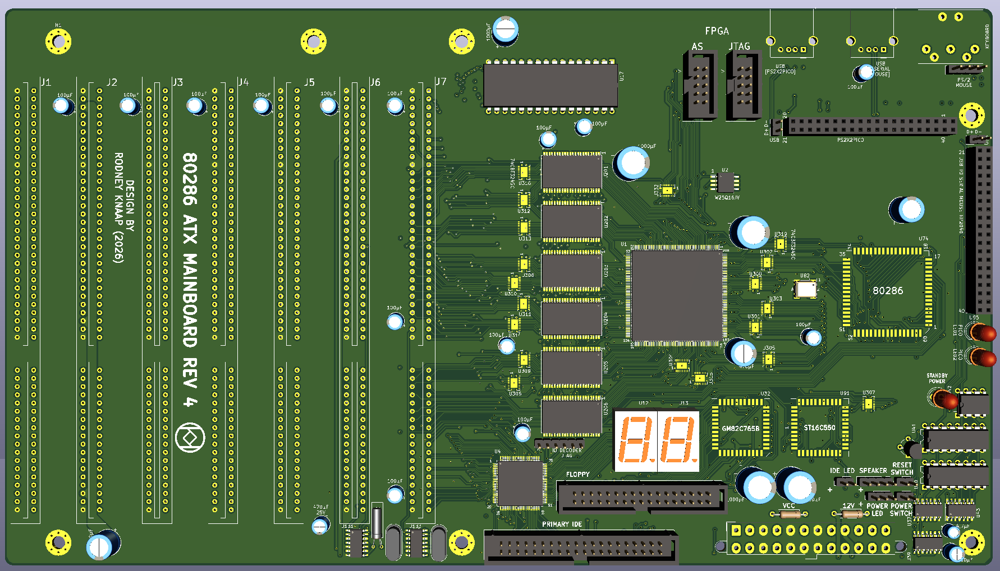
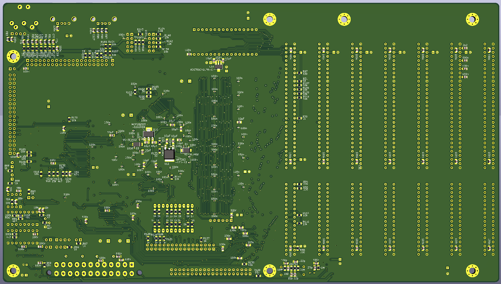

# 286 PC/AT QFP FPGA ATX mainboard revision 4  
  

ATX 286 PC/AT REV4 QFP FPGA mainboard design based on original IBM 5170 PC/AT technology  

This project is Revision 4 of my open source 286 AT ATX PC mainboard design project.
This is the first actual system design undergoing testing and debugging phases using FPGA technology.

As with the first and third revisions, this design is based on the original IBM 5170 PC/AT concept.
I am trying to put an effort into this project to attempt to maintain as much of the original PC/AT technology as possible.
In REV1 and REV3D I am aware of the fact that I have employed partial asynchronous design.
This is intentional for the time being because I have not been able yet to use a synchronous design in the system controller CPLDs.
That is not to say that this may not be possible in the future, however development and testing with a CPLD is severely limited in numbers of available registers and output enable functions.
So far, this has prevented me from getting to a functional design using a synchronous design method.  

During system control development of REV1, I have recreated each system control signal component step by step and I have tested many types of circuits, both clocked and asynchronously set/reset mechanisms. So far, certain design areas have only ever operated successfully and stably based on partial asynchronous circuits. Possibly with a higher clock speed granularity we can achieve the necessary timing with the CPLDs however I am sceptical regarding whether a CPLD can be able provide enough register capacity to achieve the necessary control timing to allow a 286 to correctly terminate the cycles. I plan to do more attempts with faster clock input on the CPLDs in the future. I am not sure yet what level of higher clock speed would be needed to be able to catch all timing moments involved in various system control areas.  

Now that we are going to use an FPGA here in the REV4 stage, it's my hope that we can create a fully new model which doesn't depend on any asynchronous setting and resetting of registers in the design.
A higher clock speed and a sufficient number of registers will help to realize this where there will be more subtle timing control possible thanks to the higher clock "resolution".
In addition, I plan to use FPGA memory blocks to generate variable timing sequences and clock transition moments which will drive the same shift register outputs that result in a single system control model.
In addition, the clock shapes from the memory blocks will serve as the dynamic clock basis for the 286 CPU.
The bits in the memory blocks will allow us to drive different cycle scenarios of the 286 CPU dynamically depending on early decoding in different parts of the 286 cycles.
Or at least, that's the plan!

I have started the FPGA work on another design repository using a large 672 pin Cyclone II BGA FPGA, however this stage has first been created/discovered purely by coincidence because I planned to test a few design aspects such as the flash configuration of the FPGA and core AT controller replacement designs on a test board, and while building up that design, I added and compiled in more and more functionality until I started to realize that I would actually probably be able to create a fully functional PC/AT design by reducing the design complexity in the following ways:  
- we don't feature a separate memory address and data bus  
- we will use the 286 high address lines A17-A22 to drive the LA17-LA22 lines on the ISA slot during CPU cycles. However the FPGA would theoretically still be able to drive these lines were it necessary for example during DMA, because the CPU will be in tri-state, allowing the FPGA to output these lines. However testing on the REV3D system has indicated that we will not need to drive these lines during DMA. There is no DMA to VGA memory and otherwise there is no target RAM present on the slots for DMA. So for this limited system we can even ignore outputting these lines. The 286 will drive them to write to VGA RAM, which is decoded by the VGA controller chip. In a later stage we could test with a bus master because we do interpret the /MASTER input from the ISA slots.  
- we will reduce DMA to only channel 2(floppy drive controller) and channel 1(sound card)  
- we will ignore a few signals which won't be needed such as the 0WS line, REFRESH and IO_CH_CHK
- no memory bus means that the design will be system bus only, SRAMs and 8 bit mode system ROM will operate on the system bus instead
- the SRAM will be in 3.3 logic, directly attached on the FPGA side of the system bus, while the ISA slots and system ROM will be located on the 5V side of the system bus.
- we will feature an external PLCC FDC and UART, the PLCC FDC also provides the FDC /DC status read port bit to the CPU.
- a small 100 pin CPLD will provide IO decoding, POST LED displays and a single IDE port, as well as do clock division for the system timer and UART.

In the smaller QFP Cyclone II FPGA we will have enough logic capacity to replace all the core AT controller chips. (hopefully but so far it appears so)
In addition we will attempt to create EMS memory which operates identically to the REV3D EMS by manipulating the system bus.
The remaining logic capacity will hopefully support developing the new system control model.

The project will consist of a reduced size 4 layer ATX mainboard only, there are 6 SRAMs on the mainboard used for XMS and EMS memory intended to support running RealDOOM with drivers developed by sqpat.  
The system ROM is a single 8 bit mode chip on the lower system data bus.

The mainboard supports the 80286 16 bit CPU, system bus driving is completely done by the FPGA via bus switch ICs.

A Harris 286 rated at 20MHz or higher is recommended, certain older manufacturing dated chips are able to run at much higher clock speeds in other systems.
Basically for composing the core PC/AT system based on IBM 5170 technology all logic is now contained within the FPA.
In addition, we will integrate the core PC/AT controller chips in the FPGA:
- the 8042 keyboard controller
- the IRQ controllers
- the DMACs
- the RTC
- the DMA page mapper chip
- the system timer

## Purpose and permitted use, cautions for a potential builder of this design
This project was created for historical purposes out of love for historical computing designs and for the purpose of enabling computing enthousiasts with a sufficient level of building and troubleshooting expertise to be able to experience the technology by building and troubleshooting the hardware described in this project. Due to the level of this project, it may be suitable as a project for students to get into. If there are any questions from teachers who like to teach about this technology I would be happy to answer them. It may be really interesting to analyse the elaborate and complex CPU timing and 8 bit to 16 bit data byte translation and DMA mechanisms in an educational setting.

Besides the GPL3 license there are a few warnings and usage restrictions applicable:
No guarantees of function or fitness for any particular or useful purpose is given, building and using this design is at the sole responsibility of the builder.

Do not attempt this project unless you have the necessary electronics assembly expertise and experience, and know how to observe all electronics safety guidelines which are applicable.

It is not permitted to use the computer built from this design without the assumption of the possibility of loss of data or malfunction of the connected device. To be used strictly for personal hobby and experimental purposes only. No applications are permitted where failure of the device could result in damage or injury of any kind.

If you plan to use this design or any part of it in new designs, the acknowledgement of the designer and the design sources and inspirations, historical and modern, of all subparts contained within this design should be included and respected in your publication, to accredit the hard work, time and effort dedicated by the people before you who contributed to make your project possible.

No guarantee for any proper operation or suitability for any possible use or purpose is given, using the resulting hardware from this design is purely educational and experimental and not intended for serious applications. Loss of data is likely and to be expected when connecting any storage device or storage media to the resulting system from this design, or when configuring or operating any storage device or media with the system of this design.

When connecting this system to a computer network which contains stored information on it, it is at the sole responsibility and risk of the person making the connection, no guarantee is given against data loss or data corruption, malfunctions or failure of the whole computer network and/or any information contained inside it on other devices and media which are connected to the same network.

When building this project, the builder assumes personal responsibility for troubleshooting it and using the necessary care and expertise to make it function properly as defined by the design. You can email me with questions, but I will reply only if I have time and if I find the question to be valid. Which will probably also lead to an update here. I want to primarily dedicate my time to new project development, I am not able to do any user support, so that's why I provide the elaborate info here which will be expanded if needed.

These disclaimers and conditions may seem unfriendly but remember that they are by no means meant to reflect on you as a reader personally or individually, just imagine that all possible people and unwise use and situations still need to be covered since this project is openly published on the internet, which means any person on the planet is able to find the information, thus also the comments are meant for every possible person who wants to use the information. I am reasonably assuming that 99% of people will be civilized enough to observe respect and common sense.

# Revision 4 design of a PC/AT mainboard based on QFP FPGA technology  
For background information and previous acknowledgements, please first see the REV1 and REV3D design repository, as well as the REV4 large BGA design repository. 
Please note: the REV4 PC/AT BGA FPGA system design using the 672 pin FPGA will continue after this system has been built and debugged/developed.

The information provided here is purely meant to describe the differences and changes in the REV4 QFP FPGA PC/AT system design.

## LA23
The system design will attempt to feature EMS memory on the system bus. This poses some design challenges because on the same system bus we have memory (VGA) and IO which responds to the address and command states that appear on the system bus. When invalid address states are asserted on the system bus this could potentially lead to false decodes and crashes/freezing of the system.  
Invalid system address states could be produced during zero wait state timing of the system address bus as well as during EMS enabled RAM cycles where the address states are output from the EMS page registers.
In order to prevent the VGA controller and IO decoder on the mainboard to be falsely triggered by these address events, I am planning to use the LA23 line. By raising this line during non slot targeting memory cycles by the 286, this will eliminate the VGA controller on the VGA card to be falsely triggered to decode VGA RAM cycles. In addition, LA23 is routed to the IO decoder CPLD and will be included there to disable all IO decodes on the chip during LA23 being raised high. Our system of this project contains 6MB of SRAM, which means that the system RAM will ever be only featured in the lower half of the memory map.  

The EMS system is planned to be able to take control only of the upper 4MB SRAM chips, where in any case, 2MB of "XMS" RAM will always remain available to guarantee a stable DOS support.  

The PCB layout is currently under development.
After that I will design a ISA memory subsystem card for the IBM 5170 system which is meant to be able to replace the entire memory bus of the 5170 mainboard.
So this ISA card will also contain the system ROM using a single 8 bit mode 1 megabit flash ROM chip.

More details will be updated here shortly,

## A big thank you goes out to everyone who has expressed their appreciation and support for my work, both here on GitHub and on the VCF forum thread!

# A few words for people who may want to help me with this project:
- I am not looking for designers that want to copy-paste and then rework my layouts
- If your intention is to really help the project, please observe some simple courtesy and respect for my years of hard work and heavy lifting that I have put in to reach this point in the project, so any commentary bashing my work or deminishing the project will be from then on be ignored completely in the future. Bashing people is not positive and not helping.
  
- the purpose of my project is to preserve historic technology by doing a best effort attempt to recreate closed designs which would otherwise be doomed to eventually become lost in time, such as period chipsets and most notably the IBM 5170 and 5162 technology.
- a secondary purpose is to achieve higher clock speeds and gain more efficiency from the 286 CPU, and reaching a more "clean" type of design, ie. more integration and less loose controller ICs, etc, resulting in a cleaner look of the board.

- I am a FPGA design beginner, and my intention is only to use the technology to aid the project, so mistakes will be made and I will work on those to correct them. Also improvisation and using instinctive design helps to gain more insight to discover the limits and pressure points of technology. If not explored and experienced, we can't learn these things in my opinion.

- I have literally zero funds to finance this project so anyone who wants to help me in any way please reach out.

Also if someone in the PC industry is still around after so many years have passed, and pleased to find my work which is also meant to attribute the importance of their technology (one can hope) please reach out, I would love to hear about it and exchange experiences.  

# PCB layout is now finished (15-3-2026)  
I have prepared the PCB layout for manufacturing, the gerber files and a few PDF documents are now uploaded in the project directory.  

A few notes regarding the PCB:  
- there are several options for using USB devices for mouse and keyboard.
Generally I suggest to use a AT keyboard on the DIN connector(or a PS/2 keyboard with adapter cable) and the USB mouse to serial solution for mouse control. This option is marked in blue color on the options picture so then these components can be used.
Alternatively, in this project I have added the components for those potential builders who would prefer a USB to PS/2 solution which enables controlling the system with USB keyboard and USB mouse. Please note: this option is as of yet untested and potential builders must examine the schematic for themselves to make sure that the PS2X2PICO solution as found here on GitHub is correctly interfaced. Details of PS2X2PICO here: https://github.com/No0ne/ps2x2pico, it's a project of user No0ne on GitHub, please see the details there. Just program the pico and insert it into the designated header. General component selection is marked in pink in the picture just to get you started.
Mouse and keyboard are interfaced using the same level shifter ICs as used for all other IO to the FPGA. If the PICO output side is also 3.3V level that should theoretically also be fine using the level shifter IC as far as I understand the IC. I have studied the datasheet and apparently it's compatible with a whole range of logic voltage levels on either side.  
![A picture of the main keyboard and mouse components(!_KEYBOARD_MOUSE_OPTIONAL_COMPONENTS_CHOOSE.png)  
PLEASE NOTE: a choice must be made what you intend to interface, then populate those components you need to connect your solution, at your own responsibility only! So don't use both methods to control the same inputs to the FPGA because I cannot predict if that would even work or if it could possibly lead to damaged components, keyboard and/or mouse. So just look at the schematic as well before proceeding to judge carefully for yourself first what you want and that nothing conflicts! You can draw out actual schematics of what you are populating and connecting to have a better picture that it's possibly viable and no damage can occur. You also could populate higher resistor values for the series resistors which can limit the currents in case of conflicts. Just a few friendly suggestions but use your own judgement if you proceed!

- the design is in prototype phase. Ordering PCBs and building the system is at the builder's own responsibility to make this work correctly. You are free to contact me however I promise no support, though I am open for reading your messages at least which is welcome as long as in a civilized tone.
- I will publish a quartus project for programming the FPGA and CPLD as soon as I am satisfied with a certain level of stability that makes the system sufficiently reliable.  

# Synchronous or not synchronous?  
I have been advised that FPGA designs must always run synchronous, which makes sense when you have sufficient programmable logic resources available to support such a model.
In the CPLD stages (REV1 and REV3D), so far, I have not found a sufficiently functional model to support a more synchronous design, so for now the REV3D system uses asynchronous programming in the system controller, which is running 100% reliable and stable in the published quartus projects for the REV3D. However achieved, the design is fully functional and in REV3D it's a whole lot more stable and fast than REV1. After revising the system control in this project, I am going to take a careful look at the logic to see whether that might be (partially) supported in the REV3D system controller. Testing, debugging and development with the FPGA may be able to provide a path toward new solutions that could be applied to REV3D if the CPLDs can make some form or derived design happen.  

## Debugging work on the REV4 QFP FPGA stage  
I am going to start development work on the FPGA where the initial goal will be to get the 286 CPU to be able to initialize and show POST diagnostic codes or beep sequences. These could then possibly provide clues to continue the debugging process. There are a lot of factors involved to be able to achieve this level of functionality. To a certain degree the HDL core AT controller equivalents will be needed to provide beep sounds and get the system through the POST sequence far enough that the CPU will be able to initialize the VGA BIOS and start to display on the screen. Part of CPU operations will depend on the asynchronous system control which may or may not be functional up to certain levels, this area of the design will become apparent as soon as I am able to test with the current designs developed up to the REV3D stage. It's not ideal and we will need to see how far this is able to function. Hopefully up to a certain level so we may continue to apply more and more synchronous areas in the system control.

I am currently working on a few other smaller PCBs in order to save on shipping costs for those.
As soon as boards are made and arrived by post I will update here.

kind regards,

Rodney
last update: 15-3-2026
