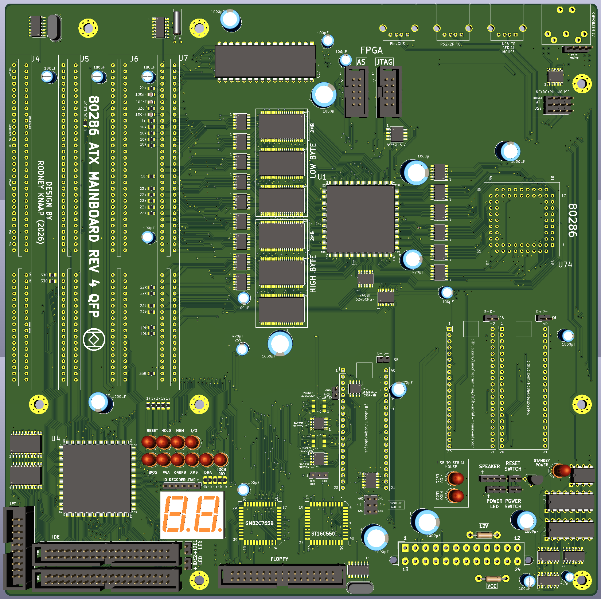

# 286 PC/AT QFP FPGA ATX mainboard revision 4  
  

ATX 286 PC/AT REV4 QFP FPGA mainboard design based on original IBM 5170 PC/AT technology  

This project is Revision 4 of my open source 286 AT ATX PC mainboard design project.
This will be the first actual system design undergoing testing and debugging phases using FPGA technology.

As with the first and third revisions, this design is based on original IBM 5170 PC/AT concepts and reverse engineered circuits from the 5170 U87 PAL.  

With this project as with previous revisions the goal will be to maintain as much of the original PC/AT technology as possible.
In REV1 and REV3D I am aware of the fact that I have employed partial asynchronous design.
With the REV3E I have released a system controller programming project which attempts to apply more synchronous regions in the system control logic inherited from the IBM 5170.  
Any asynchronous areas are for the time being fully intentional as they are because I have not been able yet to use a fully synchronous design in the system controller CPLDs of previous revisions.  
Development and testing with a CPLD is severely limited in numbers of available registers and output enable functions.
So far, this has prevented me from getting to a functional design using a fully synchronous design method, however a more synchronous version of the REV3 system controller has now been released by using a higher frequency clock input, the CPU then runs at 16MHz. Please refer to the REV3E repository for this quartus project.  

Now that we are going to use an FPGA here in the REV4 stage, it's my hope that we can create a new system control model which doesn't depend on any asynchronous setting and resetting of registers in the design, or at least greatly reduce doing so in the areas that really matter to begin with.  
A higher clock speed and a sufficient number of registers will help to realize this where there will be more subtle timing control possible thanks to the higher clock "resolution".
In addition, I plan to use the available FPGA memory blocks to generate variable timing where the clock transition moments are created in FPGA memory blocks. The bitstream from the selected memory block will then drive a single system of decoded shift register outputs that result in a single system control model. So the variation of the system control speeds will be created in the FPGA memory based clock shapes. In addition, the clock shapes from the memory blocks will serve as the dynamic clock basis for the 286 CPU to align it with system control timing.  
The bits in the memory blocks will allow us to drive different cycle scenarios of the 286 CPU dynamically depending on early decoding in different parts of the 286 cycles. Or at least, that's the plan! So the clocking bitstreams will be initially identical until the cycle decoding outputs are established after which the bitstreams will diverge to different transition timing.  

# How this version of the FPGA iteration has evolved  
I have started the FPGA work on another design repository using a large 672 pin Cyclone II BGA FPGA, however this QFP stage is now first going to be developed. I first wanted to test a few design aspects such as the serial flash based configuration using AS mode of the FPGA and core AT controller replacement designs on a test board, and while building up that design, I added and compiled in more and more functionality.   
Eventually I realized that I would actually probably be able to create a fully functional PC/AT design using the 208 pin Cyclone II FPGA by reducing the design complexity in the following ways:  
- we don't feature a separate memory address and data bus  
- we will use the 286 high address lines A17-A22 to drive the LA17-LA22 lines on the ISA slot during CPU cycles. However the FPGA would theoretically still be able to drive these lines were it necessary for example during DMA, because the CPU will be in tri-state, allowing the FPGA to output these lines. There is no DMA to VGA memory and otherwise there is no target RAM present on the slots for DMA. So for this particular system we can ignore outputting these lines for DMA purposes while the CPU is on hold because DMA will be taking place on onboard SRAM which are decoded inside the FPGA. The 286 will drive the LA lines to write to VGA RAM or read the VGA BIOS ROM, which is decoded by the VGA controller chip. In a later stage we could test with a bus master because we will interpret the /MASTER input from the ISA slots.  
- we will reduce DMA to only channel 2(floppy drive controller) and channel 1(sound card)  
- we will ignore a few signals which won't be needed such as the 0WS line, REFRESH and IO_CH_CHK
- no memory bus means that the design will be system bus only, SRAMs and 8 bit mode system ROM will all operate on the system bus instead
- the SRAM will be in 3.3V logic, directly attached on the FPGA side of the system bus, while the ISA slots and system ROM will be located on the 5V side of the system bus.
- we will feature an external PLCC FDC and UART, the PLCC FDC also provides the FDC /DC status read port bit to the CPU.

To expand into a fully integrated PC/AT mainboard and being able to make do with less expansion cards on the slots, a 208 pin CPLD has been added to the design to provide:  
- IO decoding  
- POST LED displays  
- more advanced status LED decoding to indicate system operation:  
  RESET active  
  CPU holding  
  CPU Memory cycle  
  CPU I/O cycle  
  CPU BIOS routines running  
  VGA access  
  CPU conventional memory access  
  CPU XMS memory access  
  DMA cycles  
- dual IDE ports  
- LPT port  
- clock division for the system timer and UART  

In the smaller QFP Cyclone II FPGA we will have enough logic capacity to replace all the core AT controller chips. Hopefully this will work out, but so far it appears to be the case so that's the plan with this project.  

In addition we will attempt to create EMS memory functionality which operates identically to the REV3E EMS by manipulating the system bus.  
The remaining logic capacity will then hopefully support developing the new system control model.  

The project will consist of a Micro ATX form factor mainboard, there are 6 SRAMs on the mainboard which can be used used for XMS and EMS memory intended to support running RealDOOM with drivers developed by sqpat:  
https://github.com/sqpat/RealDOOM  

The system ROM is a single 8 bit mode chip on the lower system data bus.  

The mainboard supports the 80286 16 bit CPU, system bus driving is completely done by the FPGA via bus switch ICs.  

A Harris 286 rated at 20MHz or higher is recommended, the highest clock speed verified ones are known to be made in early 1990s years.  
Basically for composing the core PC/AT system based on IBM 5170 technology all logic is now contained within the FPGA.  
In addition, we will integrate the core PC/AT controller chips in the FPGA:  
- the 8042 keyboard controller  
- the IRQ controllers  
- the DMACs  
- the RTC  
- the DMA page mapper chip  
- the system timer  

## Purpose and permitted use, cautions for a potential builder of this design
This project was created for historical purposes out of love for historical computing designs and for the purpose of enabling computing enthousiasts with a sufficient level of building and troubleshooting expertise to be able to experience the technology by building and troubleshooting the hardware described in this project. Due to the level of this project, it may be suitable as a project for students to get into. If there are any questions from teachers who like to teach about this technology I would be happy to answer them. It may be really interesting to analyse the elaborate and complex CPU timing and 8 bit to 16 bit data byte translation and DMA mechanisms in an educational setting.

Besides the GPL3 license there are a few warnings and usage restrictions applicable:
No guarantees of function or fitness for any particular or useful purpose is given, building and using this design is at the sole responsibility of the builder.

Do not attempt this project unless you have the necessary electronics assembly expertise and experience, and know how to observe all electronics safety guidelines which are applicable.

It is not permitted to use the computer built from this design without the assumption of the possibility of loss of data or malfunction of the connected device. To be used strictly for personal hobby and experimental purposes only. No applications are permitted where failure of the device could result in damage or injury of any kind.

If you plan to use this design or any part of it in new designs, the acknowledgement of the designer and the design sources and inspirations, historical and modern, of all subparts contained within this design should be included and respected in your publication, to accredit the hard work, time and effort dedicated by the people before you who contributed to make your project possible.

No guarantee for any proper operation or suitability for any possible use or purpose is given, using the resulting hardware from this design is purely educational and experimental and not intended for serious applications. Loss of data is likely and to be expected when connecting any storage device or storage media to the resulting system from this design, or when configuring or operating any storage device or media with the system of this design.

When connecting this system to a computer network which contains stored information on it, it is at the sole responsibility and risk of the person making the connection, no guarantee is given against data loss or data corruption, malfunctions or failure of the whole computer network and/or any information contained inside it on other devices and media which are connected to the same network.

When building this project, the builder assumes personal responsibility for troubleshooting it and using the necessary care and expertise to make it function properly as defined by the design. You can email me with questions, but I will reply only if I have time and if I find the question to be valid. Which will probably also lead to an update here. I want to primarily dedicate my time to new project development, I am not able to do any user support, so that's why I provide the elaborate info here which will be expanded if needed.

These disclaimers and conditions may seem unfriendly but remember that they are by no means meant to reflect on you as a reader personally or individually, just imagine that all possible people and unwise use and situations still need to be covered since this project is openly published on the internet, which means any person on the planet is able to find the information, thus also the comments are meant for every possible person who wants to use the information. I am reasonably assuming that 99% of people will be civilized enough to observe respect and common sense.

# Revision 4 design of a PC/AT mainboard based on QFP FPGA technology  
For background information and previous acknowledgements, please first see the REV1 and REV3E design repository, as well as the REV4 large BGA design repository. 
Please note: the REV4 PC/AT BGA FPGA system design using the 672 pin FPGA will continue after this system has been built and debugged/developed.

The information provided here is purely meant to describe the differences and changes in the REV4 QFP FPGA PC/AT system design.

## using LA23 to prevent accidental decoding by the VGA controller
The system design will attempt to feature EMS memory on the system bus. This poses some design challenges because on the same system bus we have memory (VGA) and IO which responds to the address and command states that appear on the system bus. When invalid address states are asserted on the system bus this could potentially lead to false decodes and crashes/freezing of the system.  
Invalid system address states could be produced during zero wait state timing of the system address bus as well as during EMS enabled RAM cycles where the address states are output from the EMS page registers.
In order to prevent the VGA controller and IO decoder on the mainboard to be falsely triggered by these address events, I am planning to use the LA23 line. By raising this line during non slot targeting memory cycles by the 286, this will eliminate the VGA controller on the VGA card to be falsely triggered to decode VGA RAM or VGA BIOS ROM cycles. In addition, LA23 is routed to the IO decoder CPLD and may be included there to disable all IO decodes on the chip during LA23 being raised high. Our system of this project contains 6MB of SRAM, which means that the system RAM will ever be only featured in the lower half of the memory map.  

The EMS system is planned to be able to take control only of the upper 4MB SRAM chips, where in any case, 2MB of "XMS" RAM will always remain available to guarantee a stable DOS support that contains conventional RAM.  

The PCB layout is now finished.

## A big thank you goes out to everyone who has expressed their appreciation and support for my work, both here on GitHub and on the VCF forum thread!

# A few words for people who may want to get in touch or respond to this project:  
I must keep a clear mind and concentration on the work and not get distracted with irrelevant messaging so I will be discerning between how people approach their communication towards me and the project in general.  
- sincerely helpful and respectful tips and advice with normal wording are always welcome and much appreciated, and I will be glad to engage in communication with everyone who observes this  
- nitpicking, bashing and grandiose rants will not result in any replies or consideration of the content  

The purpose of my project is to preserve historic technology by doing a best effort attempt to recreate closed designs which would otherwise be doomed to eventually become lost in time, such as following the concepts used in period chipsets and most notably preserving the IBM 5170 and 5162 technology which is at the basis of all AT PC technology that followed in the years after the IBM PC team created these systems.  

A secondary purpose besides preservation is to achieve higher clock speeds and gain more efficiency from the 286 CPU, and reaching a more "clean" type of design, ie. more integration and less separate controller ICs in the system, resulting in a cleaner look of the board and overall cleaner system.  

I have literally zero funds to finance this project so if anyone wants to help me in any way please reach out.  

Also if someone in the PC industry is still around after so many years have passed, and pleased to find my work which is also meant to attribute the importance of their technology (one can hope) please reach out, I would love to hear about it and exchange valuable experiences which will inspire me and all other retro PC enthusiasts. Your work mattered and we all hope for more detailed insider information from this era where internet forums were not established yet.  

# Micro ATX form factor PCB layout is now finished (21-6-2026)  
The gerber files and a few PDF support documents are available in the project directory.  

A few further notes regarding the PCB:  
- USB or AT (PS/2) keyboard and mouse are both possible, please refer to the jumper block near the keyboard connector which enables to either connect the keyboard and mouse pins from the FPGA to the back connectors, or to connect these with the PS2X2PICO for which there is a footprint on the mainboard. Please refer to the project by NoOne here on GitHub, and thanks go out to his great work making it possible to convert the PS/2 mouse and keyboard to USB:  
https://github.com/No0ne/ps2x2pico  
- USB to serial mouse conversion created by LimeProgramming is also included with a dedicated footprint for the RP2040 PICO which can be programmed with his project to connect a USB mouse or mouse receiver and connect as a serial mouse to the DOS driver or windows 3.1 support etc:  
https://github.com/LimeProgramming/USB-serial-mouse-adapter  
- Support for the PicoGUS by polpo as featured here on GitHub is also included here on the mainboard, with many thanks to polpo for all his hard work!
Please note: the logic provided here is untested and unverified with the PicoGUS programmed RP2040 so no guarantees are given that this will work and please refrain from contacting polpo about my non standard implementation here on this board, instead please wait for my test results as an indication if and how well it can work. Particularly I will need to test PicoGUS IO compatibility with a faster clocked 286 CPU. Otherwise the DMA speeds are likely low enough.
More details about polpos project which is always under development can be found on his GitHub page:  
https://github.com/polpo/picogus  
- the design is in prototype phase. Ordering PCBs and building the system is at the builder's own responsibility to make this work correctly. You are free to contact me however I promise no support, though I am open for reading your messages at least which is welcome as long as in a civilized tone.
- I will publish a quartus project for programming the FPGA and CPLD as soon as I am satisfied with a certain level of stability that makes the system sufficiently reliable.  

## Debugging work on the REV4 QFP FPGA stage  
I am going to start development work on the FPGA where the initial goal will be to get the 286 CPU to be able to initialize and show POST diagnostic codes or beep sequences. In addition, status LEDs are available to indicate what the CPU is doing. The POST codes and status LEDs could then possibly provide clues to continue the debugging process. In order to output status information the 286 CPU will need to at least be able to read the ROM and do the necessary I/O reads and writes. There are a lot of factors involved to be able to achieve this level of functionality. To a certain degree the HDL core AT controller equivalents will be needed to provide beep sounds and get the system through the POST sequence far enough that the CPU will be able to initialize the VGA BIOS and start to display on the screen. Part of CPU operations will depend on the existing initially asynchronous system control which may or may not be functional up to certain levels. This aspect of the design will become apparent as soon as I am able to test with the existing designs developed up to the REV3E stage. Hopefully these can function up to a certain level even if only in a very limited way so we may then continue to apply more and more synchronous areas to evolve the system control.  

Further updates will follow as soon as I am able to build this project up and start with testing and debugging the system.

Thanks for your interest, and if you like the project, consider adding a star which also helps to show me how much interest there generally is for this specific project among the people who come across the repository.  

# Update regarding the project blog  
From july 2026 I will only update my project blog on my own website and I will update the readme info on GitHub for the projects.  

So anyone who is interested is hereby invited to take a look at my website.
I created a forum system there and if you like to join, feel free to send me an email and I will create a login for you so you can post subjects and reply to threads. 

You can find my website in the repository link URL or via https://www.knaapic.nl  
The menu "Historic computing" contains dedicated pages for the repository projects.
A lot of information is the same as here but some details have been elaborated on my website.
The forum link is: 
https://knaapic.nl/community/   

Thank you for your interest, I look forward to hearing from you!

Kind regards,

Rodney

Updated last on july 11th, 2026.
